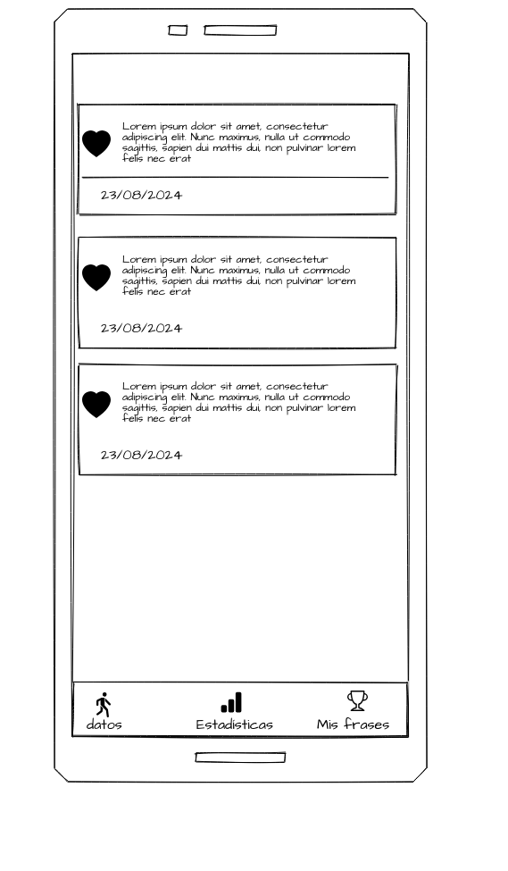

  

# Proyecto-DDI-KeepGoing
## Integrantes
- Moya Díaz Karla
- Trujillo Azpeitia Andrea
- Ramirez Campos Juan de Dios

# Enunciado de visión.
"Desarrollar una aplicación móvil innovadora que se conecte con dispositivos wearables para registrar la recuencia cardíaca y la temperatura y motivar a los usuarios a través de frases inspiradoras. La aplicación utilizará Flutter para el desarrollo móvil y APIs de dispositivos wearables para proporcionar una experiencia de usuario sin interrupciones, fomentando un estilo de vida saludable de una manera divertida y atractiva."

# Software empleado.
- [Git](https://git-scm.com) 
- [VSCode](https://code.visualstudio.com/)
- [Android Studio](https://developer.android.com/studio?hl=es-419)
- [Flutter SDK](https://docs.flutter.dev/get-started/install)
- [MQTT Broker](https://mosquitto.org)

  
# Hardware empleado.
- Placa ESP32
### Sensores:
- Frecuencia Cardiaca Max30100
- Temperautra MAX30205

### Dispositivos moviles 
- Dispositivo android
### Computadora para desarrollo
- Requisitos minimos:
- 8GB RAM
- 1TB de almacenamiento o 256GB de SSD

# Historias de usuario.
  
## Historia de Usuario 1: Monitoreo de Ejercicio
Como usuario, quiero que la aplicación registre mi frecuencia cardíaca.
    Criterios de Aceptación:
- La aplicación debe conectarse con el wearable y obtener datos en tiempo real.
- Los datos de la frecuencia cardíaca y el oxígeno deben mostrarse en la pantalla de monitoreo.
  
## Historia de Usuario 2: Frases Motivacionales
Como usuario, quiero recibir frases motivacionales basadas en timpos estrategicos para inspirar.
    Criterios de Aceptación:
- Debe mostrar una frase motivacional en la pantalla de monitoreo cada cierto timpo transcurrido. 

# Prototipo propuesto 

# Ruta del tablero
- [Tablero en Trello](https://trello.com/invite/b/Xq6jTaFR/ATTI21a09b24e08dbf764fb0d385649f96dcD42161E3/keep-going)

# Resultados
## Prototipo

